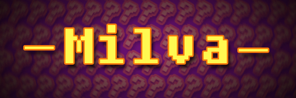

# Node Knockout 2017 - Entry details

> http://dumplings.2017.nodeknockout.com/

## Entry Name

Milva - Take a break. Take a quiz!

## Screenshort

## Quick intro

Funny application where you can take a quiz or create a new one.

## Description

You can answer on some questions.
I'm from Poland so, questions are in polish 🇵🇱

You can create your own quizzes! 🚀

## Instructions

My plans:
- share quizzes due to all connected clients
- Display ranking of single quiz by current logged users
- Display ranking of single quiz by all registered users
- Setup time limit in configuration
- Display time on question
- Redirect to next question when time is end
- Display question hints (step by step) when they defined
- Add to AddQuizPage field where user can defined hints

## Screencast / YouTube URL

TODO

## Resources

I was used:
- **Vue.js** - as a frontend view
- **Vuex** - as state manager
- **Express** - to serve static files
- **hightlihgt.js** - to have colorful listings
- **is-my-json-valid** - my favourite library
- **slug** - to normalize some string (categories)
- **socket.io** - ehh... I've fuckup to start this on Heroku...

My workspace:
- os: **macOS Sierra **
- editor: **WebStorm** (of course)
- browser: **Google Chrome 62**
